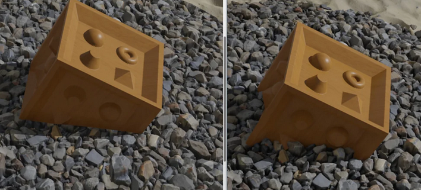

<div markdown="1" class="pagnated-page-wrapper" data-page-index="0">

## Parallax Mapping

One of my favourite things about programming is that inspiration can come out of nowhere. This post exists because I read the words "Steep Parallax Mapping", became curious about what that meant and then found myself in a research rabbit hole where I wound up not only learning about Steep Parallax Mapping but I also got to learn Parallax Occlusion Mapping and how to output directly to the depth buffer. The demo will showcase these different approaches as you read through this post, but will start with Parallax Occlusion Mapping enabled as it provides the best visual quality.

Parallax mapping at a high level is a graphics technique that provides the appearance of additional surface detail by using a depth texture to offset the UV coordinates prior to sampling the main texture. The offset itself is often calculated through the following code:

```c
vec2 offset = viewDir.xy * bumpScale / viewDir.z;
offset *= texture2d(depthMap, uv).r;
```

Where *viewDir* is the tangent space view direction, *bumpScale* is a uniform scalar value, and the depth information is packed into the red channel of the *depthMap*.

The issue with this approach to parallax mapping is that it's very inaccurate, this is because we're sampling the depth texture from our initial contact point and then assuming that's how far we'll travel until we hit the underlying depth map. Whilst this is somewhat acceptable for low frequency textures, like bricks and floorboards, the inaccuracy is problematic in this case as it can cause a significant amount of detail loss caused by the view ray flying through gradients.

Tap the button below to switch to standard parallax mapping.

<button class="in-post-button" style="margin:auto; width: 100%; min-height: 2rem;" data-cmd-call='SetVanilla'> Show Standard Parallax Mapping </button>

## Steep Parallax Mapping

<button class="in-post-button" style="margin:auto; width: 100%; min-height: 2rem;" data-cmd-call='SetSteep'> Show Steep Parallax Mapping </button>

Steep parallax mapping provides a method to increase the accuracy of the parallax effect significantly. It does by sampling the depth map on regular steps along the view ray and comparing the height of the step to the height of the depth map. This is essentially done with a raymarching loop, a good example of which can be found in this [poster](https://web.archive.org/web/20211101234032/https://casual-effects.com/research/McGuire2005Parallax/mcguire-steepparallax-poster.pdf) by Morgan McGuire and Max McGuire. This poster is what originally got me excited about this approach, namely using a Stepped Parallax Mapping for the monkey's fur. Whilst I've written a shell fur renderer in the past, and will likely port one to this website sometime in the near future, utilising Steep Parallax Mapping instead seems like a good way to also avoid some issues that come with a shell renderer, namely overdraw should be less of a problem.

The setup for Steep Parallax Mapping is similar to standard Parallax Mapping, however it takes into account the number of steps we'll take into the surface and uses that to create a delta value that we'll add to the texture coordinates on each loop in the raymarching loop. Below is the code that sets up the delta value:

```c
float numSteps = 30.0;
vec2 delta = viewDir.xy * BumpScale / eyeDir.z * numSteps;
```

The same caveats apply to this code sample as the one in the intro, this code essentially calculates how far we'll travel across the UV coordinates for each step. Then the raymarching loop uses the following code:

```c
float perLayerDepth = 1.0 / numSteps;
float currentDepth = 0.0;
vec2 currentUV = uv;
float sampledDepth = texture2D(DepthMap, currentUV).r;

while(currentDepth < sampledDepth)
{
	currentDepth += perLayerDepth;
	currentUV -= delta;
	sampledDepth = texture2D(DepthMap, currentUV).r;
}

```

The most important output for the raymarching loop is *currentUV*, this value can be used for sampling the albedo and other textures in the same way the offset would have been added to the UV in the simple parallax mapping approach.

Something interesting this approach supports, although it hasn't been implemented for this demo is self shadowing. To do this, you'd have to utilise a secondary raymarching loop in the lighting fired in the direction of the light source to and then react to any intersections accordingly.

Sampling the depth map at regular intervals ensures that there is less chance of tunnelling (the ray travelling through something but not detecting an intersection) and with a high enough step count it would be possible to render even the most tiny of details. This is however impractical, whilst modern GPU's are brilliant, and Steep Parallax Mapping dates back to at least 2005, the fact is repeatedly sampling a texture will not scale well. As you're more likely to see inaccuracies at sheer angles, a simple optimisation you can perform is to base the step count on the view angle (the z value in the tangent space view direction).

To help demonstrate some of the visual artefacts that can occur with steep parallax mapping, I've kept my number of steps relatively low. One of my favourite inaccuracies that can be seen is the 3D printer like layer lines that start appearing at large angles. Whilst this would likely break immersion with realistic visual effects, I mainly like it because it visually demonstrates the fixed step nature of the raymarcher.

This was initially where I planned to be done with this post, but then I sent the demo to one of my friends and he replied telling me about Unreal's Parallax Occlusion Mapping and included the picture below which naturally inspired me to delve deeper into the rabbit hole.



## Parallax Occlusion Mapping

<button class="in-post-button" style="margin:auto; width: 100%; min-height: 2rem;" data-cmd-call='SetOcclusion'> Show Parallax Occlusion Mapping </button>

Parallax Occlusion Mapping produces a more accurate approximation by building on top of the Steep Parallax Mapping approach. It does this by linearly interpolating the final UV coordinate between the two points before and after the intersection with the depth map has been found. This approach opens the door to rendering tiny details without requiring a lot of steps.

The linear interpolation is weighted the difference between the step height and the sample depth at both the points before and after the intersection. This can be seen in the code block below:

```c
//..After the ramarch loop has found the intersection with the depth map
vec2 previousUV = currentUV + delta;

float afterIntersectionDiff = sampledDepth.r - currentDepth;
float beforeIntersectionDiff = texture2D(depthMap, previousUV).r - (currentDepth - perLayerDepth);
float weight = afterIntersectionDiff / (afterIntersectionDiff - beforeIntersectionDiff);

currentUV = mix(currentUV, previousUV, weight);
```

Alongside enhancing the shader's ability to render smaller details, this also will improve visual quality by masking the previously mentioned layer lines. This effect is still dependent on having a decent step count especially at grazing angles, but in most use cases for parallax mapping such as adding detail to walls and floors, these artefacts won't be too noticeable.

For more detail about parallax mapping, as well as Steep Parallax Mapping and Parallax Occlusion Mapping, I recommend this article as a jumping off point: [LearnOpenGL - Parallax Mapping](https://learnopengl.com/Advanced-Lighting/Parallax-Mapping)

## Depth Correction

Going back to the image my friend sent me, I had been immediately curious about how you'd correct the output depth value of the fragment to play nicely with other objects. Prior to reading more about Parallax Occlusion Mapping, I naturally thought that was what it'd do, mainly because of the word occlusion in it's name. This obviously wasn't the case but I was too curious to not just implement the depth correction myself.

As I'm using ThreeJS as a rendering engine for this demo and targeting WebGL2, the shader has been written in GLSL. This means I can optionally set the depth value of the fragment through gl_FragDepth. This is an area I definitely need more practice in, as modifying the depth myself isn't something I've done too often, but my assumption is that this is expecting the projection space depth of the fragment (and hopefully it doesn't turn out that I need to add support for things like logarithmic depth buffers). Based on this assumption I realised that I need to convert the tangent space position of where we've hit the depth map into projection space.

First, the tangent space position is a 3D vector, in which the X and Y coordinates are set to the *currentUV* position that was produced by the raymarcher, and the Z represents how deep into the surface we are, which is the depth from the raymarcher multiplied by the Bump Scale value.

With this value, it is then theoretically possible to multiply the tangent space position by a matrix which takes you from tangent space to projection space. The approach I used instead was to calculate the length from the original UV position to the tangent space position and then use the worldspace view direction to add that length to the worldspace position. With that it can be converted into view space and the depth be simply calculated using the near and far plane values.

## Additional Notes

On Apple Silicone this shader currently produces a lot more visual artefacts than can be seen on other platforms. This is something I'm currently investigating and if I find a cause I'll post a followup.

One big problem with this approach is that it is quite branch heavy, this is one of my suspected reasons for why it can look bad on MacOS, I know that branching can cause any functions that rely on neighbouring cells (like perhaps mipmapping) to produce unexpected results.

I'm also quite interested in looking into how the GPU deals with this many texture reads from a cache point of view. So I'll be reading into that shortly.

Below I've included the buttons that have been toggling features in this post so that you can easily compare things.

Thanks for reading :)

<button class="in-post-button" style="margin:auto; width: 100%; min-height: 2rem;" data-cmd-call='SetVanilla'> Show Standard Parallax Mapping </button>
<button class="in-post-button" style="margin:auto; width: 100%; min-height: 2rem;" data-cmd-call='SetSteep'> Show Steep Parallax Mapping </button>
<button class="in-post-button" style="margin:auto; width: 100%; min-height: 2rem;" data-cmd-call='SetOcclusion'> Show Parallax Occlusion Mapping </button>

<label for="bump_scale">Bump Scale</label> 
<input type="range" id="width_and_depth" class="in-post-inputfield" data-cmd-call='SetBumpScale' value="0.1" min="0.0" max="0.5" step="0.01"/>

<label for="depth">Depth Correction</label> 
<input type="checkbox" id="depth" data-cmd-call='SetDepthCorrection' class="in-post-inputfield" checked/>
   
<label for="sphere">Sphere Visible</label> 
<input type="checkbox" id="sphere" data-cmd-call='SetSecondaryObjectVisible' class="in-post-inputfield" checked/>

</div>
